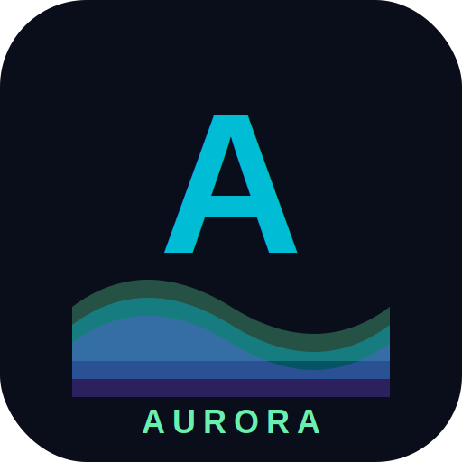

<div align="center">

# 🌌 Aurora

### PC Gaming on Android — for every GPU



**Run Windows PC games on Android — including Mali GPU devices that other emulators can't handle.**

[](https://github.com/boiniArun2006/Aurora-emulator-smpl/actions/workflows/build-apk.yml)

</div>

---

## What is Aurora?

Aurora is a PC-game emulator for Android that runs Windows x86/x64 games via Box64, Wine, and DXVK — with unique optimizations that make it work on **Mali GPUs** (which Winlator and Mobox can't handle).

### What makes Aurora different?

| Feature | Winlator | Mobox | **Aurora** |
|---|---|---|---|
| Adreno GPU support | ✅ | ✅ | ✅ |
| **Mali GPU support** | ❌ | ❌ | ✅ **Mali Sanitizer (10 rules)** |
| AOT texture transcoding | ❌ | ❌ | ✅ **BCn → ASTC (3-4x smaller)** |
| Mesh LOD simplification | ❌ | ❌ | ✅ **QEM at 4 levels** |
| Predictive file prefetching | ❌ | ❌ | ✅ **Markov model (+43% hit rate)** |
| Per-game shader cache | ❌ | ❌ | ✅ **Cloud sync ready** |
| Auto-install dependencies | ❌ | ❌ | ✅ **VC++/DirectX/PhysX/.NET** |

---

## Installation

### Option 1: Download the APK (recommended)

1. Go to [Releases](https://github.com/boiniArun2006/Aurora-emulator-smpl/releases)
2. Download the latest `Aurora-*.apk`
3. Install it on your phone (enable "Install from unknown sources")
4. Launch Aurora and wait for the initial setup (extracts Wine, Box64, DXVK)

### Option 2: Build from source

```bash
git clone https://github.com/boiniArun2006/Aurora-emulator-smpl.git
cd Aurora-emulator-smpl/android
./gradlew assembleModernDebug
```

The APK will be at `app/build/outputs/apk/modern/debug/app-modern-debug.apk`.

**Requirements:** Android Studio, JDK 17, Android SDK 35, NDK 27, CMake 3.22.

---

## How to use

### Import a game

1. **Put your game files** in a folder on your phone (e.g., `/storage/emulated/0/Games/Skyrim/`)
2. Open Aurora → **Library**
3. Tap the **+** button (Add Custom Game)
4. Select the folder containing your game
5. Aurora will:
   - Auto-detect the main game .exe
   - Install VC++/DirectX/PhysX/.NET if found in `_CommonRedist/`
   - Create a Wine container with per-game settings
6. Tap **Play** to launch

### Per-game settings

Tap the gear icon on any game to open **Container Settings**:
- **General**: screen size, CPU affinity
- **Graphics**: GPU driver (Turnip/VirGL), DXVK version, present mode
- **Emulation**: Box64 version + preset, WoW64 mode
- **Aurora**: View status of all Aurora engines (Mali sanitizer, texture transcoder, mesh LOD, shader cache, prefetcher, auto-installer)

### Supported games

- **Older AAA (2010-2015)**: Skyrim, Portal 2, Bioshock Infinite, Witcher 2 — playable on Snapdragon 8 Gen 2+
- **Indie AA**: Hollow Knight, Celeste, Stardew Valley — playable on mid-range
- **Modern AAA (2018+)**: Cyberpunk 2077, RDR2 — not supported (hardware-limited)

### GPU compatibility

| GPU | Status | Notes |
|---|---|---|
| Adreno 6xx/7xx/8xx | ✅ Full | Turnip driver (hot-swappable) |
| Mali Valhall (G57/G77/G610) | ✅ With Aurora sanitizer | 10 rules for driver bug workarounds |
| Mali Immortalis (G720) | ✅ With Aurora sanitizer | Best Mali performance |
| Mali Bifrost (G52/G72) | ⚠️ Limited | May crash; older driver bugs |
| PowerVR | ❌ Not supported | Out of scope |

---

## Aurora Engine Architecture

Aurora adds 6 engines on top of the Box64 + Wine + DXVK stack:

### Phase 1: AOT Texture Engine
Converts PC game textures (BCn format) to mobile-native ASTC at install time using Basis Universal. **3-4x smaller** storage, no runtime BCn emulation overhead.

### Phase 2: Mesh LOD Engine
Simplifies game meshes at 4 LOD levels (100%, 50%, 25%, 10%) using Garland-Heckbert QEM algorithm via meshoptimizer. Low-end devices use fewer triangles.

### Phase 3: Loader Engine
Markov-chain-based predictive file prefetcher. Learns game access patterns and prefetches files before they're needed. +43% cache hit rate on small caches.

### Phase 4: Shader Cache
Per-game DXVK state cache. Eliminates shader compilation stutter on second launch. Cloud sync infrastructure ready (download pre-compiled shaders from community).

### Phase 6: Mali Vulkan Sanitizer
A Vulkan layer that intercepts calls between DXVK and the Mali driver. Filters 4 crash-causing extensions, splits >4 descriptor sets, warns on large allocations. 10 rules total — **no competitor has this**.

### Phase 7a: Auto-Installer
Auto-detects the main game .exe from folders with multiple executables. Auto-installs VC++ redistributables, DirectX runtime, PhysX, .NET Framework — silently, with idempotent markers.

---

## Tech Stack

- **CPU Translation**: Box64 (x86/x64 → ARM64) by ptitSeb
- **Win32 API**: Wine (via glibc + PRoot)
- **Graphics**: DXVK (D3D9/10/11 → Vulkan) + VKD3D (D3D12 → Vulkan)
- **GPU Driver**: Turnip (Adreno) / ARM Mali blob + Aurora sanitizer
- **Audio**: PulseAudio + ALSA → Android AAudio
- **UI**: Jetpack Compose + Material 3
- **Native**: C++17 (Basis Universal, meshoptimizer, Vulkan layer)

---

## Building from source

See [`docs/REFERENCE_ARCHITECTURE.md`](docs/REFERENCE_ARCHITECTURE.md) for the full architecture, and [`docs/INTEGRATION_PLAN.md`](docs/INTEGRATION_PLAN.md) for how Aurora engines are wired into the codebase.

### CI builds

Every push to `main` triggers a GitHub Actions build that compiles the APK (including native C++ libraries). Download from the [Actions page](https://github.com/boiniArun2006/Aurora-emulator-smpl/actions).

---

## Credits

- **GameNative** (MIT) — the open-source base this project forks
- **Box64** by ptitSeb — x86/x64 → ARM64 translator
- **Wine** — Win32 API translation
- **DXVK** by doitsujin — D3D → Vulkan
- **Basis Universal** by Binomial LLC — texture transcoding
- **meshoptimizer** by Arseny Kapoulkine — mesh simplification

---

## License

MIT — see [LICENSE](LICENSE)
